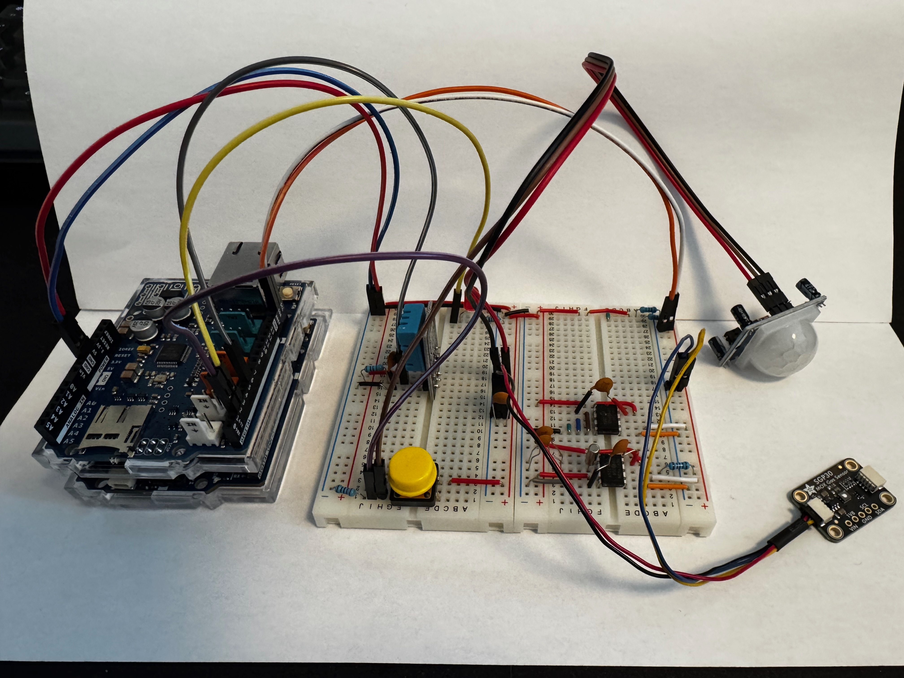
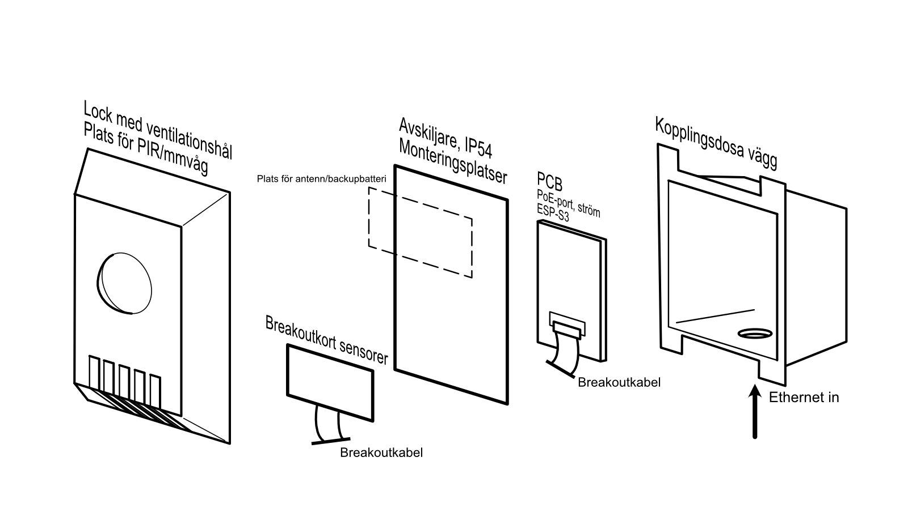

# Chas Challenge 2025 "Kusten är Klar"

**SUVX24 Authors:** [Jennifer Gott](https://github.com/simbachu), [Sabina Stawbrink](https://github.com/binasime), [Oscar Asserlund](https://github.com/NewNamesAreHard), [Erik Dahl](https://github.com/erikdsp), [Johan Modin](https://github.com/bubba-94)  

### Beskrivning

PAX är ett bokningssystem bestående av olika sensorer och teknologier i en hel produkt som mäter aktivitet och olika miljödata i konferensrum, kopplade till en enhet. Den insamlade datan hanteras av en IoT-komponent som kommunicerar med en backend via ett API, där data lagras i en databas. Med PAX kan du på ett effektivt och automatiserat sätt, övervaka statusen på era olika lokaler.  

### Komponenter

| **Komponent**                     | **I/O Pin**           | **Beskrivning**                                     |
| --------------------------------- | --------------------- | --------------------------------------------------- |
| **Arduino Uno R4 WiFi**           |                       | Microkontroller för inkoppling.                     |
| **PIR-sensor HC-SR501**           | **2**                 | Används för att detektera rörelse i rummet.         |
| **LED**                           | **3**                 | Används för att driva en LED.                       |
| **Temp-sensor DHT11**             | **6**                 | Används för temperaturmätning i rummet.             |
| **Luftkvalitets-sensor SPG30**    | **SDA(A4) / SCL(A5)** | Används för att mäta luftkvaliteten i rummet.       |
| **Internet Interface Config Pin** | **7**                 | Används för att indikera val av nätverks interface. |

## Bygga projektet

Här följer beskrivning för att bygga IoT-delen av projektet. För övriga delar se dokumentation i [backend](https://github.com/alicegmn/paxdb) respektive [frontend](https://github.com/Kusten-ar-klar-Chas-Challenge-2025/pax/tree/main/pax-mobile) 

### Platform IO

Installera PlatformIO och öppna undermappen pax/Iot med PlatformIO.  
PlatformIO kommer automatiskt installera de beroenden som är definierade i Platformio.ini.  
Skapa en .h fil kallad **`arduino_secrets.h`** i **`/include`** mappen.  
Kopiera mallen under för att konfigurera din egna uppkoppling (SSID, Password, URL) mellan sensor och wifi.  

``` cpp

#ifndef ARDUINO_SECRETS_H      // Header guard 
#define ARDUINO_SECRETS_H 

#define SECRET_SSID "SSID"     // Your WiFi SSID
#define SECRET_PASS "PASSWORD" // Your WiFi password 

// Server configuration
#define SERVER_URL "paxdb.vercel.app"
#define SERVER_PORT 443       // Default HTTPS port
#define API_PATH "" 

// Auth configuration
#define JWT_USER "email"      // Your email for login
#define JWT_PASS "password"   // Your password for login

// Device configuration
#define DEVICE_UUID "UUID2"  // UUID for initial registration
#define ROOM_OVERRIDE 30     // Optional room ID override for testing


#endif
```

### Registrera enhet
Detaljerad information: [Device Registration.md](./docs/Device%20Registration.md)  
För testning kan du använda `ROOM_OVERRIDE` beskrivet ovan. Se [backend API](https://paxdb.vercel.app/rooms) för tillgängliga rum.  

### Bygg
Välj den byggversion som är lämplig för din användning, **release** eller **debug**. Debug har omfattande printing vilket kommer göra körandet långsammare.

Koppla enheten enligt [kopplingsschemat](./docs/SCH_PAX-Schematic_1-P1_2025-05-26.png). Se till att det finns en motsvarighet till varje sensor för att kunna utvärdera beteendet. EEPROM behöver kopplas så att den är på address 0x50.

Ladda upp den byggda mjukvaran till hårdvaran. Skrivningar till servern kan ses via backendverktyg eller i appen (se länkar till backend och frontend ovan).

### Sensorkalibrering
Temperatursensorn kan kalibreras med meddelanden över Serial (Baud Rate: 115200).  
`TEMP0`, `TEMP+<float>` och `TEMP-<float>`är giltiga kommandon.   
Exempel: `TEMP+2.5` sätter en offset på 2.5 °C  
Mer info om kalibrering: [send_temperature_offset](./calibration/README.md)  

### Hårdvaru-bild


### Möjlig industrialiserad design



## Ytterligare Dokumentation IoT
[Projektplan](./docs/PROJEKTPLAN.md)  

[SRS](./docs/SRS.md)  

[API-Dokumentation](./docs/API-DOCUMENTATION.md)  

[Accessibility](./docs/ACCESSIBILITY.md)  

[Changelog](./docs/CHANGELOG.md)  

[Retrospektiv - gemensam för alla team](../RETROSPECTIVE.md)  

[Retrospektiv - IoT möjlig vidareutveckling](./docs/RETROSPECTIVE.md)  

[Arkitektur](./docs/ARCHITECTURE.md)  

[Kopplingsschema](./docs/SCH_PAX-Schematic_1-P1_2025-05-26.png)  

[Testning](./docs/TESTING.md)  

[Doxygen - utförlig dokumentation av IoT-mjukvaran](https://kusten-ar-klar-chas-challenge-2025.github.io/pax/files.html)  

